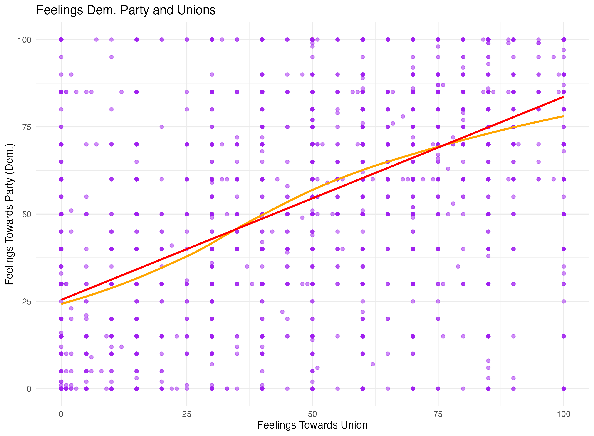

Political Data  - Visualiazations in R
| | | | 
|:-------------------------|:-------------------------:|-------------------------:|
|  Party Affiliation |  Party Affiliation Among Union Members
|   Sentiment Towards Democratic Party Given Age |   Sentiment Towards Democratic Party and Unions
| Estimated Budget Deficits |
